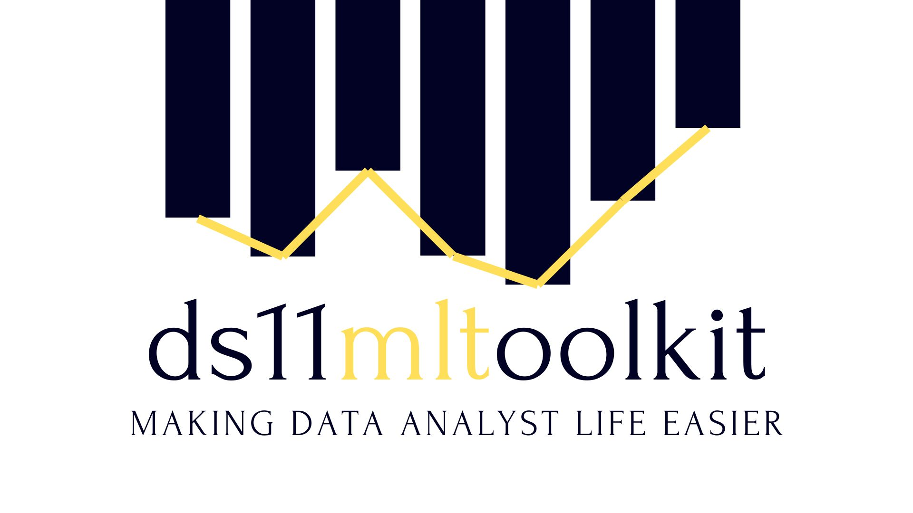

Welcome to ds11mltoolkit, we are delighted to see you here!

Thank you for your interest, and we hope this library can help you in your daily life as a **Data Scientist**



[](https://www.thebridge.tech/)  

## Table of contents
- What is ds11mltoolkit?
- How to install ds11mltoolkit
- Dependencies
- Functions and methods
 - Data Analysis
 - Data visualization and exploration
 - Data processing
 - Machine Learning
- Github framework
- Contributors

## What is ds11mltoolKit?

It is a Python package that will help you in your first steps as a Data Scientist. *"Faster, cleaner, easier"* From simple databasis to complex neural networks, this library will accelerate your work processes in all stages of the machine learning cycle.

## How to install ds11mltoolkit?

Install as you would normally install a Pypi library.

```
pip install ds11mltoolkit
```

We suggest to import ds11mltoolkit as mlt, to make it easier to deploy by the users

```
import ds11mltoolkit as mlt
```

# Dependencies

ds11mltoolkit requires these libraries to work properly:

- beautifulsoup4==4.11.1
- imblearn==0.0
- keras==2.11.0
- matplotlib==0.1.6
- nltk==3.8.1
- opencv-python-headless==4.7.0.68
- pandas==1.3.5
- Pillow==9.3.0
- plotly==5.11.0
- requests==2.28.1
- scikit-image==1.0.2
- scikit-learn==0.19.3
- scipy==1.7.3
- seaborn==0.12.1
- selenium==4.7.2
- tensorflow==2.11.0
- wordcloud==1.7.0

## Functions and methods

In the current version, ds11mltoolkit will provide users around 40 functions, divided in 4 groups:

## Data Analysis

* read_url
* read_csv_zip
* chi_squared_test

## Data visualisation and exploration

* heatmap
* sunburst
* correl_map_max
* plot_map
* plot_ngram
* wordcloudviz
* plot_cumulative_variance_ratio
* plot_roc_cruve
* plot_multiclass_prediction_image

## Data processing

* list_categorical_columns
* last_columns
* uniq_value
* load_imgs
* class ImageDataGen(ImageDataGenerator) 3-in-1 functions
* clean_text
* processing_model_classification
* replace_convert_numeric
* log_transform_numeric
* add_previous
* _exponential_smooth
* Nan treatment
* convert_to_numeric
* auto_dtype_converter
* winner_loser
* lstm_model

## Machine Learning

* export_model
* import_model
* worst_params
* load_model_zip
* quickregression
* polynomial_features_non_binary
* balance_binary_target
* image_scrap
* create_multiclass_prediction_df
* show_scoring
* predict_model_classification
* Unsupervised KMeans
* UnsupervisedPCA


## Quick example


```

df = pd.DataFrame(data= {'Cities': ['Madrid', 'Barcelona'], 
                            'Teams': ['Team 1', 'Team 2'],
                            'Players': ['Vinicius', 'Pedri'],
                            'Goals': [10, 9]})


def list_categorical_columns(df):
    '''
    Function that returns a list with the names of the categorical columns of a dataframe.

    Parameters
    ----------
    df : dataframe
    
    Return
    ----------
        features: list of names

    '''
    features = []

    for c in df.columns:
        t = str(df[c].dtype)
        if "object"  in t:
            features.append(c)
    return features

list_categorical_columns(df)

output: ['Cities', 'Teams', 'Players']


```

## Github framework


## Contributors

- [Miguel de Frutos](https://github.com/Migueldfr)
- [Pedro Vergara](https://github.com/pericotronic)
- [Bogdan Radacina](https://github.com/BogdanBoyan92)
- [Sean Stevenson](https://github.com/seenstevo)
- [José Nevado](https://github.com/JNevado81)
- [Celia Cabello](https://github.com/celiacnavarro)
- [Jared Rivas](https://github.com/JaredR33)
- [Nicolás Eyzaguirre](https://github.com/NicolasEyzaguirre)
- [Enrique Moya](https://github.com/3Moya)
- [Javi López](https://github.com/javlopsan)
- [Kyung Min Ohn](https://github.com/exAdun)
- [Leandro Salvado](https://github.com/Lean788)
- [Ramón Fernández](https://github.com/RamonFCerezo)

# License

ds11mltoolkit uses an “Interface-Protection Clause” on top of the MIT license. This library is free for personal use. Therefore, it can be used for both commercial and non-commercial purpose. 

[See license](https://github.com/TheBridgeMachineLearningPythonLibrary/MachineLearningToolKit/blob/dev/LICENSE.txt)
---

Please don't hesitate to contact us if you have any questions or comments. Thank you for using our library!